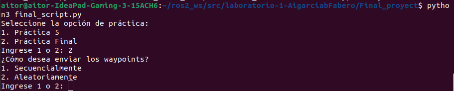

# Proyecto Final: Navegación Avanzada con Interacción por Voz

## Desarrollo

El script desarrollado, implementa un sistema de navegación robótica usando **ROS 2**, combinando reconocimiento de voz y navegación autónoma hacia puntos específicos (**waypoints**).

- **Carga de waypoints:**  
  Lee coordenadas desde un archivo YAML (`read_waypoints`).

- **Síntesis de voz:**  
  Usa `espeak` para generar audio con mensajes (`synthesize_speech`).

- **Reconocimiento de comandos:**  
  Captura comandos de voz con la librería `speech_recognition` (`recognize_command`).

- **Navegación autónoma:**  
  Configura y ejecuta la navegación a un punto específico, monitoreando el progreso y resultado (`navigate_to_waypoint`).

- **Interfaz interactiva:**  
  Permite elegir entre dos prácticas:
  1. **Práctica 5:** Navegación a un waypoint fijo.
  2. **Práctica Final:** Navegación por waypoints secuenciales o aleatorios, con posibilidad de detener o continuar mediante comandos de voz.

## Ejecución del proyecto
Para ejecutar el proyecto, debemos tener abierto en un terminal el simulador de turtlebot3:
```bash
cd turtlebot3_ws
colcon build
source /opt/ros/humble/setup.bash
source install/setup.bash
export TURTLEBOT3_MODEL=waffle
ros2 launch turtlebot3 simulation.launch.py
```

en otro terminal, se ejecuta el script de navegación (también se puede hacer desde VSC):
```bash
cd /ros2_ws/src/laboratorio-1-AigarciabFabero/Final_proyect
python3 final_script.py
```

Cabe destacar que para el correcto desarrollo de la práctica, es necesario instalar las siguientes dependencias:
```bash
pip install SpeechRecognition pyaudio
```

El script de navegación lanza sobre terminal la posibilidad de realizar la práctica 5 o la práctica final. Si elegimos esta última, tenemos la opción de recorrer los waypoints de manera secuencial o aleatorio. 



Finalmente, tenemos un gift para comprobar el correcto funcionamiento del script:


## Preguntas

**1. ¿Cómo se implementó la lectura de waypoints desde el archivo y cómo se integró con Nav2 Simple Com-mander?**

La lectura de waypoints se realizó utilizando la biblioteca yaml en Python. El archivo YAML contiene una lista de waypoints, cada uno con coordenadas x, y y la orientación theta. Se define una función llamada `read_waypoints` para procesar el archivo y devolver los datos como una lista de diccionarios. Los waypoints leídos del archivo se convierten en objetos `PoseStamped` requeridos por Nav2 Simple Commander. Esto se hace mediante la función `navigate_to_waypoint`, que toma cada waypoint (en formato de diccionario) y lo convierte a `PoseStamped` para enviar al robot.

```python
def read_waypoints(yaml_file):
    with open(yaml_file, 'r') as file:
        data = yaml.safe_load(file)
        waypoints = data.get('waypoints', [])
    return waypoints
```

```python
def navigate_to_waypoint(navigator, waypoint, choice):
    goal_pose = PoseStamped()
    goal_pose.header.frame_id = 'map'  # Marco de referencia
    goal_pose.pose.position.x = waypoint['x']
    goal_pose.pose.position.y = waypoint['y']
    
    # Convertir theta a cuaternión
    theta = waypoint['theta']
    goal_pose.pose.orientation.z = math.sin(theta / 2)
    goal_pose.pose.orientation.w = math.cos(theta / 2)

    navigator.goToPose(goal_pose)

    # Monitorea el progreso hacia el objetivo
    while not navigator.isTaskComplete():
        feedback = navigator.getFeedback()
        if feedback:
            print(f"Distancia restante al objetivo: {feedback.distance_remaining:.2f} metros")
        time.sleep(1)  

    # Verifica el resultado final de la navegación
    result = navigator.getResult()
    if result == TaskResult.SUCCEEDED:
        print("El robot alcanzó el objetivo.")
        if (choice == '2'):
            synthesize_speech("He alcanzado el objetivo.")
        return True
    elif result == TaskResult.CANCELED:
        print("La navegación fue cancelada.")
        if (choice == '2'):
            synthesize_speech("La navegación fue cancelada.")
        return False
    else:
        print("La navegación falló.")
        if (choice == '2'):
            synthesize_speech("La navegación falló.")
        return False
```

**2. ¿Qué paquetes o herramientas se utilizaron para la síntesis y reconocimiento de voz en ROS 2?**

Para el reconocimiento de voz se ha empleado la biblioteca `speech_recognition` de Python, que nos permite capturar y procesar comandos de audio empleando el micrófono del computador. Este proceso lo hemos hechjo definiendo la función `recognize_command`

```python
def recognize_command():
    """
    Utiliza la librería speech_recognition para reconocer comandos de voz.
    Asegúrate de tener instaladas las dependencias:
    pip install SpeechRecognition pyaudio
    """
    recognizer = sr.Recognizer()
    with sr.Microphone() as source:
        print("Escuchando comando de voz...")
        audio = recognizer.listen(source)
    try:
        command = recognizer.recognize_google(audio, language='es-ES')
        print(f"Comando reconocido: {command}")
        return command.lower()
    except sr.UnknownValueError:
        print("No se entendió el comando.")
        return ""
    except sr.RequestError as e:
        print(f"Error con el servicio de reconocimiento de voz; {e}")
        return ""
```

Para la sintesis de voz, se empleó el motor speak con configuración en español. 

```python
def synthesize_speech(message):
    """
    Utiliza espeak para la síntesis de voz.
    Asegúrate de tener espeak instalado: sudo apt-get install espeak
    """
    subprocess.call(['espeak', '-v', 'es', '-s', '135', message])
```

**3. Describe el proceso para configurar y cambiar entre múltiples planificadores locales en Nav2 antes o durante la ejecución. ¿Cómo se realizaría este proceso desde fichero de configuración?**

Para cambiar entre múltiples planificadores locales, debemos modificar el archivo `waffle.yaml` del espacio de trabajo de turtlebot3_ws. Cada planificador es un plugin que se puede activar dinámicamente.

```yaml
controller_server:
  ros__parameters:
    controller_plugins: ["FollowPath", "DWB", "TEB"]

    FollowPath:
      plugin: "nav2_regulated_pure_pursuit_controller::RegulatedPurePursuitController"

    DWB:
      plugin: "dwb_core::DWBLocalPlanner"
      debug_trajectory_details: True

    TEB:
      plugin: "teb_local_planner::TebLocalPlannerROS"
```

Antes de iniciar Nav2, puedes definir el planificador local por defecto en el archivo de parámetros (waffle.yaml).

```yaml
controller_server:
  ros__parameters:
    current_controller: "DWB"
```