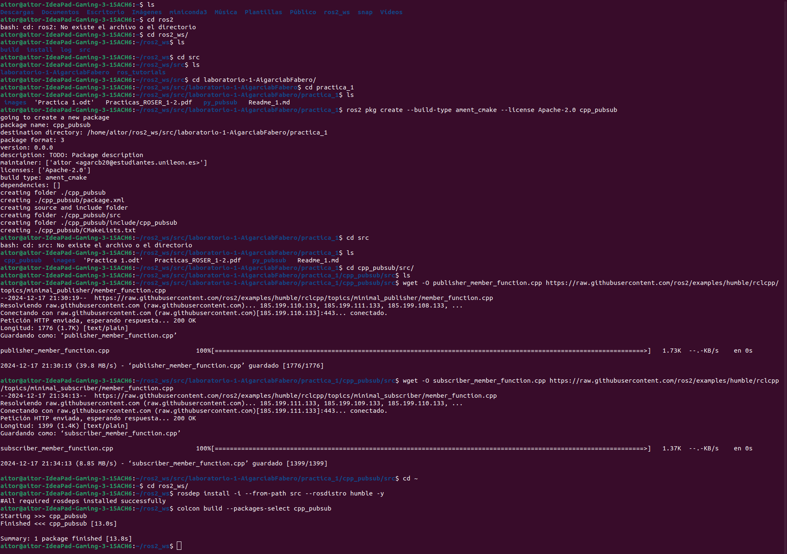
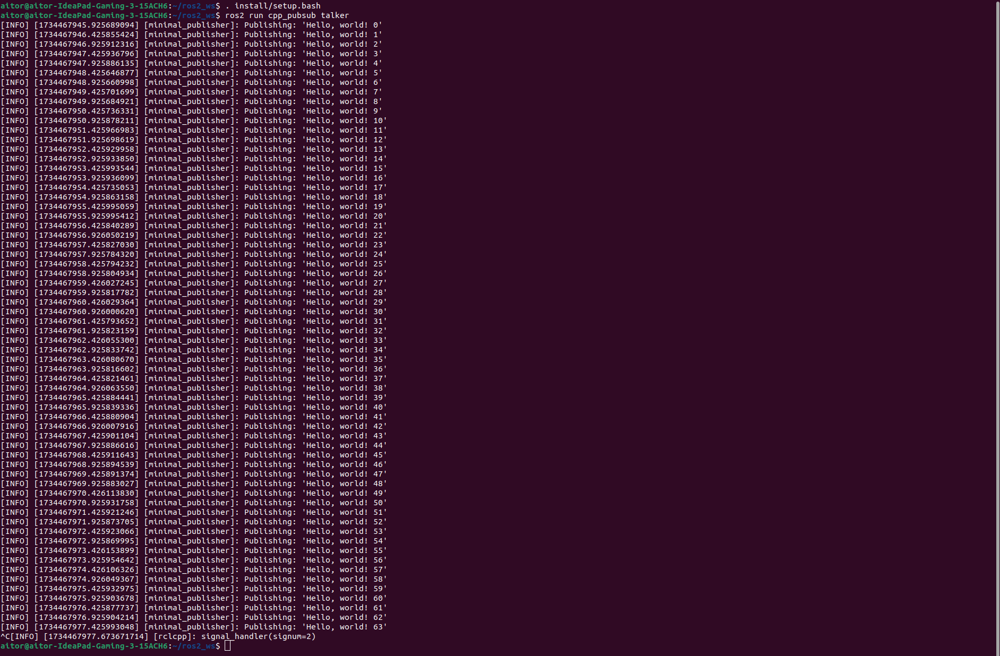
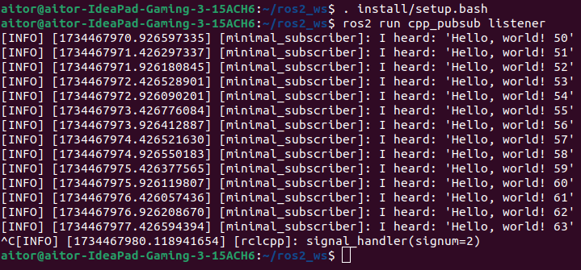
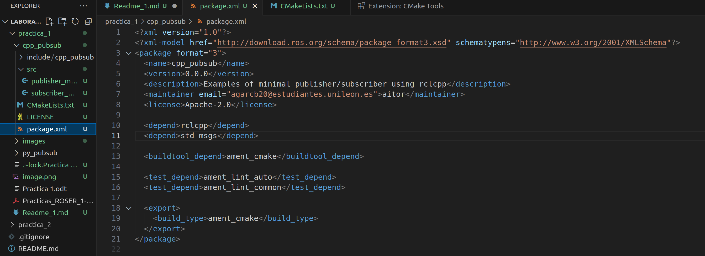
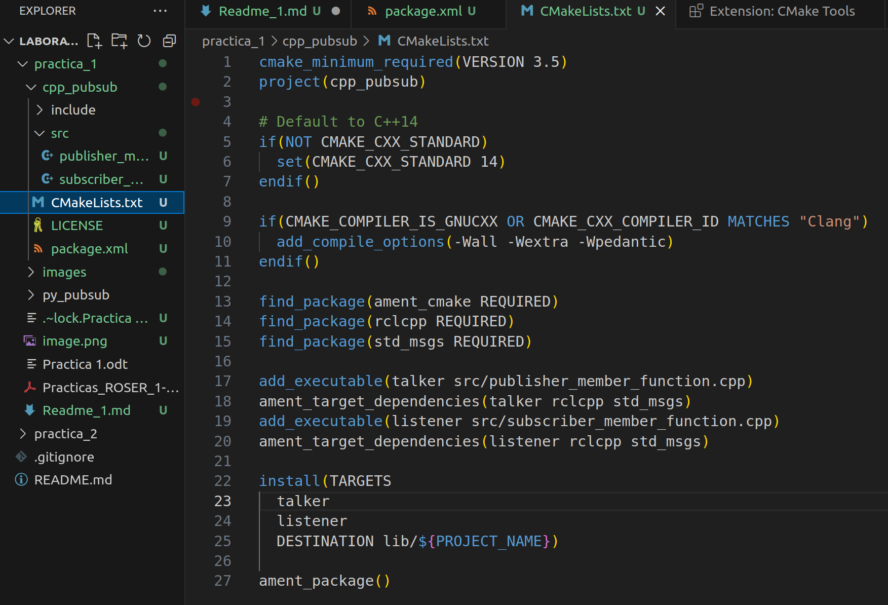
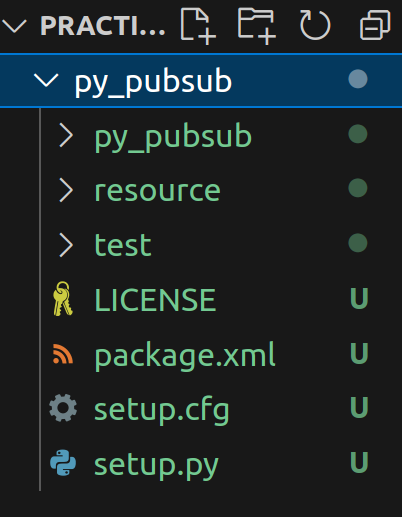
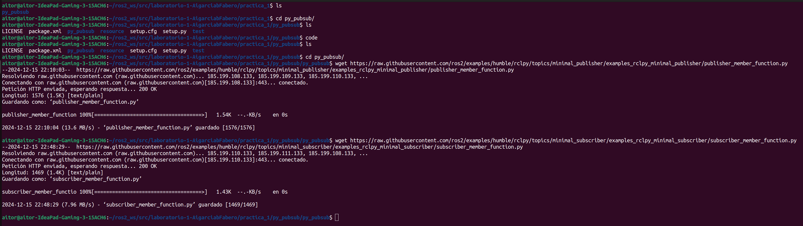
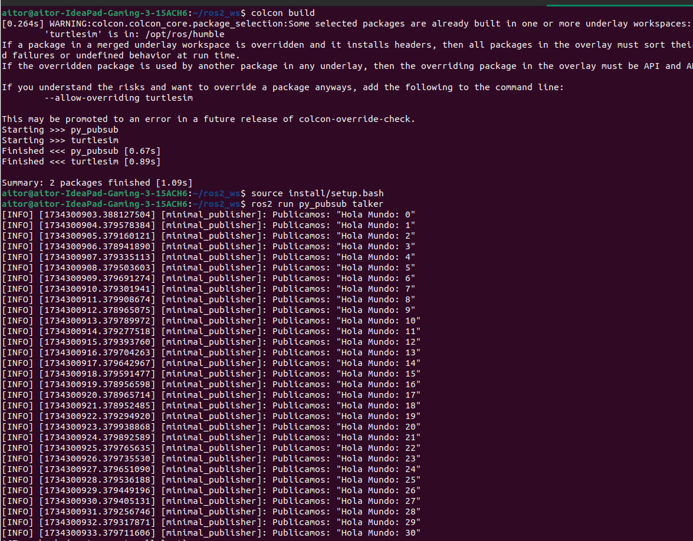
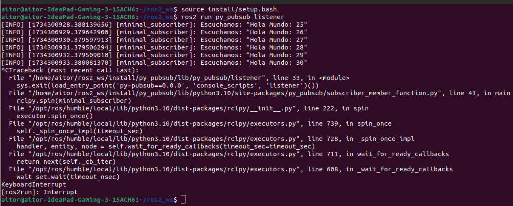
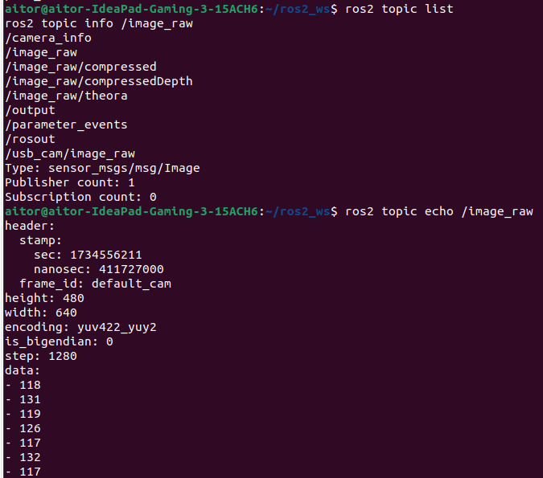

# Práctica 1: Introducción a ROS 2

1. [CREAR UN ENTORNO DE TRABAJO](#1-crear-un-entorno-de-trabajo)
2. [CREAR UN EJEMPLO BÁSICO DE PUBLISH/SUBSCRIBE Y COMPILAR CON COLCON](#2-crear-un-ejemplo-básico-de-publishsubscribe-y-compilar-con-colcon)
   - Cpp
   - Python
3. [REVISAR LOS EJEMPLOS BÁSICOS DE PUBLISH/SUBSCRIBE QUE NOS ENCONTRAMOS EN ESTE REPOSITORIO](#3-revisar-los-ejemplos-básicos-de-publishsubscribe-que-nos-encontramos-en-este-repositorio)
4. [ENUMERAR LOS PARÁMETROS QUE HACEN FALTA EN COLCON PARA COMPILAR UN SOLO PAQUETE](#4-enumerar-los-parámetros-que-hacen-falta-en-colcon-para-compilar-un-solo-paquete)
5. [PARA QUÉ NOS SIRVE EL PARÁMETRO –SYMLINK-INSTALL. CON QUÉ LO UTILIZAS](#5-para-qué-nos-sirve-el-parámetro-symlink-install-con-qué-lo-utilizas)
6. [PARA QUÉ SE UTILIZA EL COMANDO: ROSDEP INSTALL --FROM-PATHS SRC -Y --IGNORE-SRC](#6-para-qué-se-utiliza-el-comando-rosdep-install-from-paths-src-y-ignore-src)
7. [REVISAR Y EXPLICAR LAS DIFERENCIAS ENTRE LAS CARPETAS INSTALL, DEVEL, BUILD, SRC, SRV, ROSIDL Y LOG](#7-revisar-y-explicar-las-diferencias-entre-las-carpetas-install-devel-build-src-srv-rosidl-y-log)
8. [EXPLICAR EL PROCESO PARA USAR LA CÁMARA DE TU PC CON UN COMPONENTE ROS 2](#8-explicar-el-proceso-para-usar-la-cámara-de-tu-pc-con-un-componente-ros-2)

## 1. CREAR UN ENTORNO DE TRABAJO
Aquí comienza la descripción de cómo crear un entorno de trabajo en ROS 2.

[Guía Oficial ROS 2](https://docs.ros.org/en/humble/Tutorials/Beginner-Client-Libraries/Creating-A-Workspace/Creating-A-Workspace.html)

Para el correcto desarrollo de esta práctica, he creado un entorno con Ubuntu 22.04. Después de configurar el sistema, procedí a instalar ROS 2 Humble siguiendo las instrucciones oficiales. Para esto, primero se actualizan los repositorios y después se instala el paquete `ros-humble-desktop`, que incluye las herramientas y bibliotecas básicas para trabajar con ROS 2. Además, se instala `colcon`, la herramienta recomendada para compilar proyectos en ROS 2:

```bash
sudo apt update
sudo apt install -y ros-humble-desktop
sudo apt install -y python3-colcon-common-extensions
```

### Configuración del Espacio de Trabajo de ROS 2

Nuestro espacio de trabajo en ROS 2 es una carpeta llamada `ros2_ws`, que contendrá todos los paquetes y archivos necesarios para el proyecto. Para crear esta carpeta junto con su subdirectorio `src`, que es donde almacenaremos los paquetes, utilizamos el siguiente comando:

```bash
mkdir -p ~/ros2_ws/src
```

Navegamos al directorio de trabajo

```bash
cd ~/ros2_ws
```

Debemos construir el espacio de trabajo. Esto generará las carpetas necesarias (`install`, `build`, `log`) para un espacio de trabajo de ROS 2.

```bash
colcon build
```

Se configura la terminal para poder usar los paquetes

```bash
source ~/ros2_ws/install/setup.bash
```

### Clonación del Repositorio de Prácticas

Dentro del directorio `src`, procedemos a clonar el repositorio de prácticas de robótica de servicios. Esto se hace con el comando `git clone`, seguido del enlace del repositorio proporcionado. Este repositorio incluirá el código y ejemplos necesarios para desarrollar la práctica.

```bash
cd ~/ros2_ws/src
git clone https://github.com/ULE-MURIA-24-25/laboratorio-1-AigarciabFabero.git
```

### Configuración del Entorno ROS 2

Para que los comandos de ROS 2 estén disponibles y el entorno esté correctamente configurado, es necesario sourcear el archivo de configuración de ROS 2 cada vez que abrimos una nueva terminal. Esto permite que ROS 2 cargue las configuraciones y pueda reconocer los paquetes en nuestro espacio de trabajo.

1. Primero, hacemos source del archivo de configuración de ROS 2:

   ```bash
   source /opt/ros/humble/setup.bash
   ```

2. A continuación, para automatizar este paso, añadimos el comando al archivo `~/.bashrc`, de manera que se ejecute automáticamente al iniciar una nueva terminal:

   ```bash
   echo "source /opt/ros/humble/setup.bash" >> ~/.bashrc
   ```

3. Una vez compilado nuestro workspace (en pasos posteriores), también haremos source de su archivo de configuración:

   ```bash
   source ~/ros2_ws/install/setup.bash
   ```

## 2. CREAR UN EJEMPLO BÁSICO DE PUBLISH/SUBSCRIBE Y COMPILAR CON COLCON

### Cpp

Para este punto, podemos seguir la siguiente guía: [Escribir un Publisher y Subscriber en C](https://docs.ros.org/en/humble/Tutorials/Beginner-Client-Libraries/Writing-A-Simple-Cpp-Publisher-And-Subscriber.html).











### Python

Para este punto, podemos seguir la siguiente guía: [Escribir un Publisher y Subscriber en Python](https://docs.ros.org/en/humble/Tutorials/Beginner-Client-Libraries/Writing-A-Simple-Py-Publisher-And-Subscriber.html).

Nos dirigimos al directorio de trabajo:

```bash
cd ~/ros2_ws/src/<repo>/practica_1
```

Ejecutamos la siguiente línea para crear un paquete para Python:

```bash
ros2 pkg create --build-type ament_python --license Apache-2.0 py_pubsub
```

Y verificamos que la estructura del paquete es la correcta.



Una vez hemos creado el paquete, vamos a descargar el código de un publicador y un suscriptor. Para ello, ejecutamos las siguientes líneas:

```bash
wget https://raw.githubusercontent.com/ros2/examples/humble/rclpy/topics/minimal_publisher/examples_rclpy_minimal_publisher/publisher_member_function.py
wget https://raw.githubusercontent.com/ros2/examples/humble/rclpy/topics/minimal_subscriber/examples_rclpy_minimal_subscriber/subscriber_member_function.py
```

Para no hacer extenso el readme, y para más información, recomendamos seguir la guia/tutorial de ROS 2 donde tenemos las explicaciones paso por paso detalladamente acompañadas de explicaciones de código.







## 3. REVISAR LOS EJEMPLOS BÁSICOS DE PUBLISH/SUBSCRIBE QUE NOS ENCONTRAMOS EN ESTE REPOSITORIO

Revisión de los ejemplos básicos que se encuentran en este repositorio: https://github.com/ros2/examples

```bash
cd ros2_ws/src/repo/practica_1
git clone https://github.com/ros2/examples
git checkout humble
colcon build
source install/setup.bash
```

La idea principal de revisar estos códigos, no es otra que asimilar los conceptos de nodos publicadores y suscriptores, colas, sleep y spin. Para entendrlos, vamos a explicar que es cada uno y como afectan los parámetros de estos a la hora de publicar y leer mensajes.
Un **topic**, es un canal de comunicación identificado por un nombre y tipo de mensaje. Sobre este topic, se publican y se suscriben los nodos, permitiendo así, escribir y leer sobre el topic el contenido del mensaje.
Una vez tenemos estos conceptos base bien definidos, veamos como afecta la modificación  de algunos de los parámetros de estos *publish and subscribe*.

El **tamaño de las colas** (queue size) determina cuantos mensajeas pueden almacenarse en espera si el subscriptor  no puede procesarlos tan rápido como se publican. Un tamaño de cola mayor permite almacenar más mensajes, pero puede incrementar la latencia y uso de memoria. En los ejemplos que hemos visto, hems visto como afectaba el tamaño de la cola. Cuando se publican mensajes a una frecuencia alta y el subscriptor no tiene una cola lo suficientemente grande como para procesar todos los mensajes, los mensajes que excedan el tamaño de la cola vana  ser descartados o sobreescritor, dependiendo de la configuración, lo que puede dar lugar a una pérdida de información. Para solventar este problema, debemos aumentar el tamaño de las colas con cuidado, pues se incrementa la latencia y el uso de recursos.

Añadir **sleep** en los callbacks de suscripción simula un procesamiento que le toma tiempo. Esto afecta al como se manejan los mensajes entrantes. Esto, nos permite tener un procesamiento lento al tardar en ejecutarse los *callback*, si la cola se llena antes de que el callback termine de procesar los mensajes anteriores, los nuevos mensajes pueden ser descartados como hemos visto en las clases y al ejecutar nuestros nodos *examples*. Si tenemos una ejecución de un solo hilo, mietras el calvack está en `sleep`, otros callbacks no pueden ejecutarse, afectando a la capacidad de respuesta del nodo. Por ejemplo: En el nodo suscriptor de Python anterior, el `time.sleep(1)` hace que cada mensaje tarde al menos 1 segundo en procesarse. Si el publicador envía mensajes cada 0.5 segundos, la cola puede llenarse rápidamente (dependiendo del tamaño de la cola), lo que resulta en la pérdida de mensajes.

El método **spin** es responsable de gestionar la ejecución de callbacks en los nodos. ROS2 ofrece diferentes tipos de ejecutores que determinan cómo se manejan los hilos y la concurrencia.
- Single-threaded (Por defecto): Un solo hilo maneja todos los callbacks. Si un callback bloquea (por ejemplo, debido a un sleep), otros callbacks deben esperar, lo que puede causar retrasos.
- Multi-threaded: Permite que múltiples callbacks se ejecuten en paralelo en diferentes hilos. Esto mejora el rendimiento en nodos que manejan múltiples suscripciones/publicaciones o que tienen callbacks que toman tiempo en procesarse.

Varios callbacks se pueden ejecutar simultaneamente (paralelismo), dando lugar a una ejecución más eficiente con multiples nucleos de una CPU. Además, un callback bloqueado no impide que otros callbacks se procesen. Para tener ejecuciones seguras, es importante tener en cuneta no superar el número de hilos que dispone el sistema (no sobrecargar hilos) y compartir un acceso a recursos seguro (por ejemplo, empleando mutex).

### Resumen de Impactos

**Tamaño de las Colas:**

- **Grandes:** Menos pérdida de mensajes, mayor uso de memoria.
- **Pequeñas:** Mayor latencia, posible pérdida de mensajes.

**Añadir `sleep` en Callbacks:**

- **Procesamiento Lento:** Puede llevar a colas llenas y pérdida de mensajes.
- **Bloqueo de Callbacks:** En ejecutores de un solo hilo, puede afectar la responsividad.

**Mecanismo de `spin`:**

- **Single-threaded:** Simple pero susceptible a bloqueos por callbacks lentos.
- **Multi-threaded:** Mayor eficiencia y responsividad, pero requiere manejo cuidadoso de la concurrencia.

### Buenas Prácticas

- **Evitar Bloqueos en Callbacks:** Siempre que sea posible, evita operaciones bloqueantes dentro de los callbacks. Si necesitas realizar tareas largas, considera delegarlas a hilos separados o utilizar mecanismos asíncronos.

- **Elegir Tamaño de Cola Adecuado:** Ajusta el tamaño de la cola según la tasa de publicación y la capacidad de procesamiento del suscriptor. Realiza pruebas para encontrar el equilibrio óptimo.

- **Utilizar Ejecutores Apropiados:** Para nodos con múltiples suscripciones/publicaciones o con callbacks que requieren procesamiento intensivo, utiliza ejecutores multihilo para mejorar el rendimiento.

- **Sincronización de Recursos Compartidos:** Cuando utilices ejecutores multihilo, asegúrate de proteger los recursos compartidos para evitar condiciones de carrera y otros problemas de concurrencia.


## 4. ENUMERAR LOS PARÁMETROS QUE HACEN FALTA EN COLCON PARA COMPILAR UN SOLO PAQUETE

Si queremos compilar un único paquete con colcon:

```bash
colcon build --packages-select <nombre paquete>
```

## 5. PARA QUÉ NOS SIRVE EL PARÁMETRO –SYMLINK-INSTALL. CON QUÉ LO UTILIZAS

El parámetro `--symlink-install` sirve para crear enlaces simbólicos de los ejecutables y bibliotecas en el directorio de instalación, en lugar de copiar los archivos. Esto es útil durante el desarrollo porque:

- **Facilita modificación**: Cualquier cambio que se realice en el código fuente se refleja inmediatamente en la instalación, sin necesidad de recompilar todo el paquete.
- **Ahorra espacio**: No se duplican los archivos en el sistema, lo que ahorra espacio en disco.

Se utiliza comúnmente en entornos de desarrollo, especialmente cuando se trabaja en varios paquetes que dependen entre sí.

## 6. PARA QUÉ SE UTILIZA EL COMANDO: ROSDEP INSTALL --FROM-PATHS SRC -Y --IGNORE-SRC

El comando `rosdep install --from-paths src -y --ignore-src` se utiliza en el contexto del desarrollo de software en ROS (Robot Operating System) para instalar automáticamente las dependencias necesarias de los paquetes que se encuentran en un espacio de trabajo específico.

1. **rosdep install**: Este es el comando principal que invoca `rosdep`, una herramienta que ayuda a gestionar las dependencias de los paquetes en ROS. `rosdep` determina cuáles son las dependencias que se necesitan para un paquete y se asegura de que estén instaladas en el sistema.
2. **--from-paths src**: Este parámetro le dice a `rosdep` que busque las dependencias en los paquetes que se encuentran dentro de la carpeta `src`. La carpeta `src` es donde normalmente se encuentran los paquetes que estás desarrollando. Al especificar esta opción, `rosdep` revisa los archivos de manifiesto de cada paquete en esta ruta para identificar las dependencias.
3. **-y**: Este parámetro es una opción de confirmación automática. Indica que `rosdep` debe proceder con la instalación de las dependencias sin solicitar confirmación del usuario. Esto es útil para hacer la instalación de forma automática y sin intervención manual, especialmente cuando se utilizan scripts o procesos de integración continua.
4. **--ignore-src**: Esta opción le indica a `rosdep` que ignore las dependencias que son parte del código fuente de los paquetes que se están desarrollando. Es decir, si un paquete ya está presente en el directorio `src`, no se intentará instalarlo nuevamente. Esta opción es útil para evitar conflictos y redundancias al trabajar con paquetes que ya están en tu espacio de trabajo.

Este comando permite facilitar la instalación rápida de todas las dependencias necesarias para los paquetes que se están desarrollando, asegura que las dependencias del sistema estén en orden, nos permite que todos los requisitos para la configuración inicial estén listos y ayuda a que otros desarrolladores puedan configurar rápidamente su entorno de trabajo.

## 7. REVISAR Y EXPLICAR LAS DIFERENCIAS ENTRE LAS CARPETAS INSTALL, DEVEL, BUILD, SRC, SRV, ROSIDL Y LOG

- **install**: Esta carpeta contiene los artefactos de instalación de los paquetes. Aquí se colocan los ejecutables, bibliotecas y archivos de configuración listos para ser utilizados. Cuando se usa `--symlink-install`, se crean enlaces simbólicos a los archivos fuente en lugar de copiar.
- **devel**: En ROS 1, esta carpeta se utilizaba para almacenar configuraciones de desarrollo y enlaces a los paquetes. Sin embargo, en ROS 2, `colcon` no crea una carpeta `devel` como tal; en cambio, utiliza directamente la carpeta `install`.
- **build**: Aquí se encuentran los archivos generados durante el proceso de construcción de los paquetes. Específicamente, contiene los archivos temporales y los resultados intermedios de la construcción.
- **src**: Esta carpeta contiene el código fuente de los paquetes que estás desarrollando. Aquí es donde colocas tus archivos de código y donde `colcon` busca los paquetes al construir.
- **srv**: Esta carpeta se usa para definir archivos de servicios en ROS 2. Un archivo de servicio (`.srv`) define un tipo de servicio que permite la comunicación entre nodos.
- **rosidl**: Esta carpeta es donde se generan los archivos de interfaz de descripción de mensajes y servicios para los paquetes que usan el sistema de mensajes de ROS 2. Se utiliza para la serialización y deserialización de mensajes.
- **log**: Esta carpeta contiene los registros de las construcciones y otros mensajes generados durante el proceso de construcción y ejecución de los paquetes. Puede ser útil para depurar errores y seguir el progreso de la construcción.

Cada una de estas carpetas tiene un propósito específico en el ecosistema de ROS 2 y `colcon`.

## 8. EXPLICAR EL PROCESO PARA USAR LA CÁMARA DE TU PC CON UN COMPONENTE ROS 2

Para el desarrollo de este apartado, primero debemos instalar `image_view`

```bash
sudo apt update
sudo apt install ros-humble-image-view
```

A continuación, clonamos y descargamos el código de `usb_cam`

```bash
cd /path/to/ros2_ws/src/repo/practica_1
git clone https://github.com/ros-drivers/usb_cam.git
```

Una ves lo hemos descargado, instalamos las dependencias:

```bash
rosdep install --from-paths src --ignore-src -y
```

Ahora, podemos compilar el paquete:

```bash
colcon build
source /path/to/ros2_ws/install/setup.bash
```
Asegúrese de obtener los paquetes recién compilados después de una compilación correcta.

Una vez obtenido, ejecutamos el paquete:

```bash
ros2 run usb_cam usb_cam_node_exe
```

y lanzamos usb_cam

```bash
ros2 run image_view image_view --ros-args --remap image:=/usb_cam/image_raw
```

Una vez hecho esto, se nos abre un terminal de image_view donde vemos el funcionamiento de la camara.

