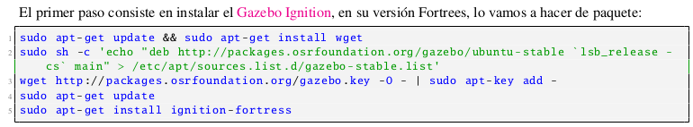
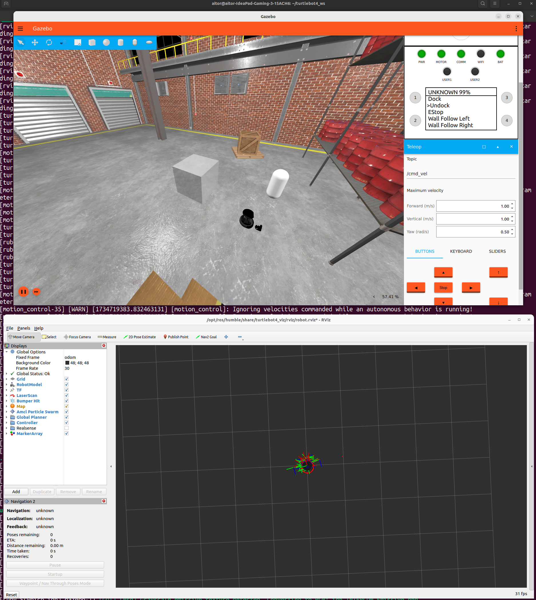
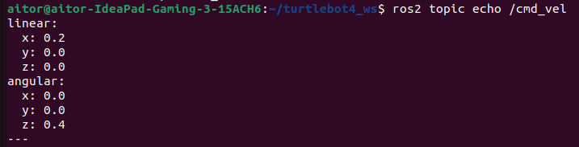

# Práctica 2: Simulando Turtlebot 4 en Gazebo Ignition

## Nuevo espacio de trabajo

Para no tener conflictos en nuestro espacio de trabajo habitual, donde tendremos turtlebot3, dedicimos crear un nuevo espacio de trabajo.

Abrimos un terminal y creamos un directorio para el espacio de trabajo:

```bash
mkdir -p ~/turtlebot4_ws/src
cd turtlebot4_ws
```

Inicializamos el espacio de trabajo ejecutando el siguiente comando:

```bash
colcon build
```

Para no pisar el espacio de trabajo `ros2_ws`, generamos dos alias para simplificar y agilizar las tareas repetitivas en la terminal. 

```bash
nano ~/.bashrc
alias ros2ws="source ~/ros2_ws/install/setup.bash"
alias turtlebot4ws="source ~/turtlebot4_ws/install/setup.bash"
source ~/.bashrc
```

## Instalación Turtlebot4 

El primer paso consiste en instalar Gazebo Ignition en su versión Fortrees. Lo hacemos de paquete:



Turtlebot4 lo instalamos en nuestro espacio de trabajo `turtlebot4_ws`. 

```bash
cd turtblebot4_ws/src
git clone https://github.com/turtlebot/turtlebot4_simulator.git -b humble
```

Instalamos las dependencias

```bash
cd ~/turtlebot4_ws
rosdep install --from-path src --ignore-src -r -y
```

Compilamos los paquetes

```bash
source /opt/ros/humble/setup.bash
colcon build --symlink-install
```

Configuramos el espacio de trabajo:

```bash
turtlebot4_ws
```

## Pruebas Turtlebot4

Para iniciar Gazebo con turtlebot4 usamos el siguinete comando: 

```bash
ros2 launch turtlebot4_ignition_bringup turtlebot4_ignition.launch.py 
```

donde podemos especificar el mundo con opciones como: depot, maze o warehouse.

```bash
ros2 launch turtlebot4_ignition_bringup turtlebot4_ignition.launch.py world:=depot
```

Para opbservar los datos de los sensores de Turtlebot, usamos RViz. 

```bash
ros2 launch turtlebot4_ignition_bringup turtlebot4_ignition.launch.py world:=depot rviz:=true
```



En este bloque se ha iniciado Turtlebot, se ha modificado el mundo de gazebo añadiendo formas y se ha controlado el turtlebot mediante la interface de gazebo y desde el teclado con la ayuda de *topics* ejecutando el siguiente comando:

```bash
ros2 run teleop_twist_keyboard teleop_twist_keyboard
```

## Nodo Python para controlar el Turtlebot

Para el correcto desarrollo de este punto, debemos crear un paquete en ROS2 para python. 

```bash
cd ~/turtlebot4_ws/src
ros2 pkg create --build-type ament_python circle_drive
```

En la carpeta del paquete `circle_drive` incluimos el script `circle_drive.py`

```python
import math
import time
import rclpy
from rclpy.node import Node
from geometry_msgs.msg import Twist, Vector3

class CircleDrive(Node):
    def __init__(self, topic_name='/cmd_vel'):
        super().__init__('circle_drive')
        self.publisher_ = self.create_publisher(Twist, topic_name, 1)
        time.sleep(2.0)

    def drive(self, wait, motion=Twist()):
        self.publisher_.publish(motion)
        time.sleep(wait)
        self.publisher_.publish(Twist())

def main(args=None):
    rclpy.init(args=args)
    node = CircleDrive()
    motion = Twist(linear=Vector3(x=0.2), angular=Vector3(z=0.4))
    wait = 2 * math.pi / motion.angular.z
    node.drive(wait=wait, motion=motion)
    rclpy.shutdown()
```
Modificamos el `setup.py`

```python
from setuptools import find_packages, setup

package_name = 'circle_drive'

setup(
    name=package_name,
    version='0.0.0',
    packages=find_packages(exclude=['test']),
    data_files=[
        ('share/ament_index/resource_index/packages',
            ['resource/' + package_name]),
        ('share/' + package_name, ['package.xml']),
    ],
    install_requires=['setuptools'],
    zip_safe=True,
    maintainer='aitor',
    maintainer_email='agarcb20@estudiantes.unileon.es',
    description='Nodo para controlar el TurtleBot en un círculo.',
    license='Apache License 2.0',
    tests_require=['pytest'],
    entry_points={
        'console_scripts': [
            'circle_drive = circle_drive.circle_drive:main',
        ],
    },
)
```

modificamos el documento package.xml añadiendo las dependencias necesarias:

```xml
<build_depend>ament_python</build_depend>
<exec_depend>rclpy</exec_depend>
<exec_depend>geometry_msgs</exec_depend>
```

Una vez tenemos hecho todo esto, se instalan las dependencias, se compila el paquete, y se ejecuta el nodo. Además, se comprueba que en el topic `/cmd_vel` se publican los mensages que envia el nodo.

```bash
rosdep install --from-paths src --ignore-src -r -y
colcon build --symlink-install
sourceamos con el alias -> turtlebot4_ws
ros2 run circle_drive circle_drive
```

