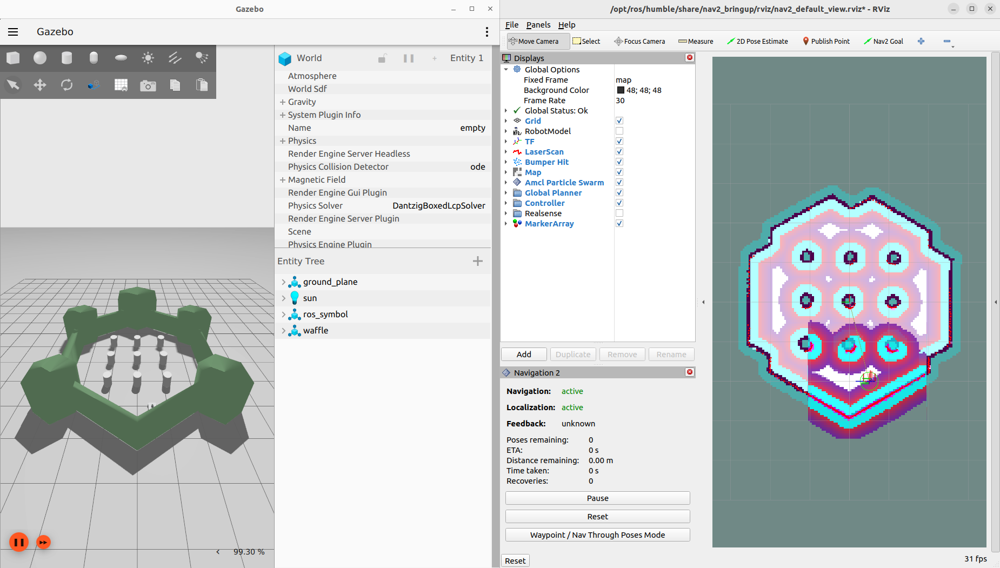
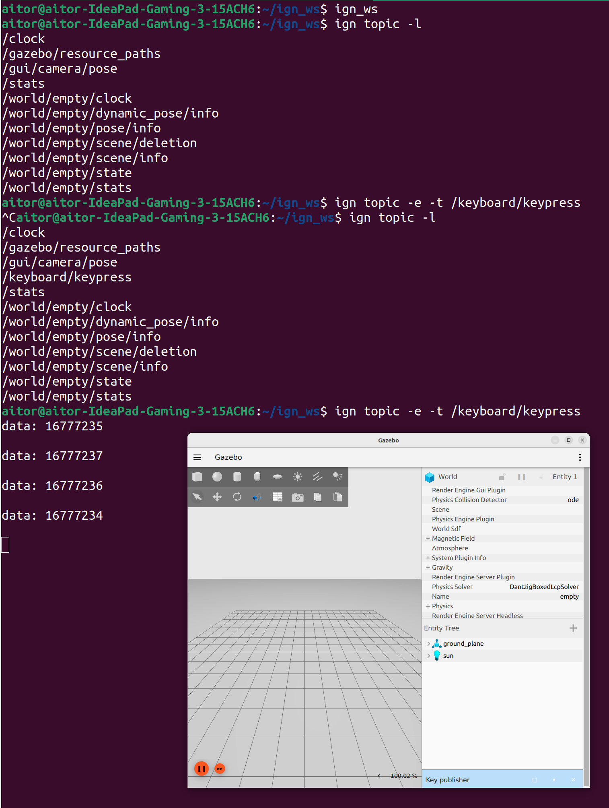
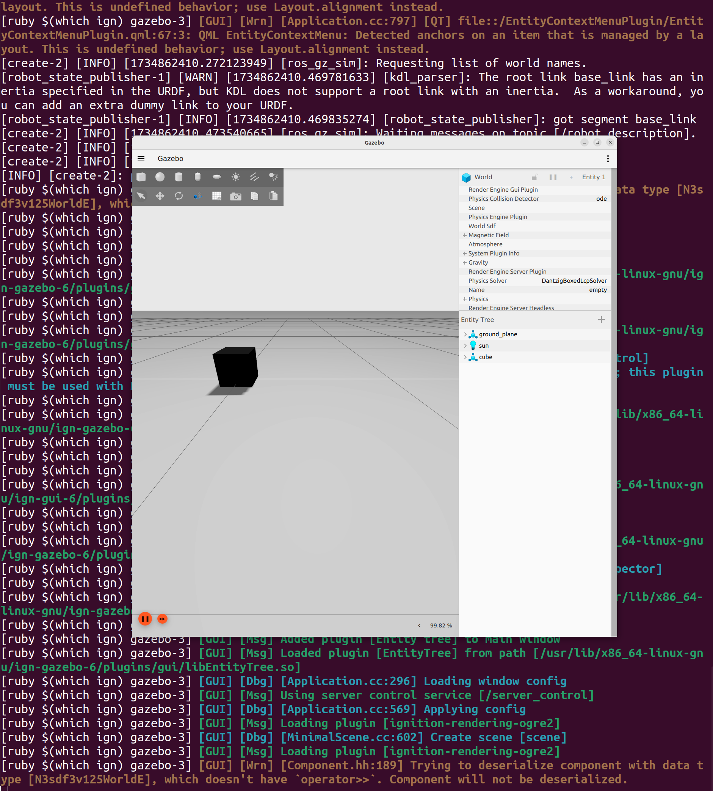
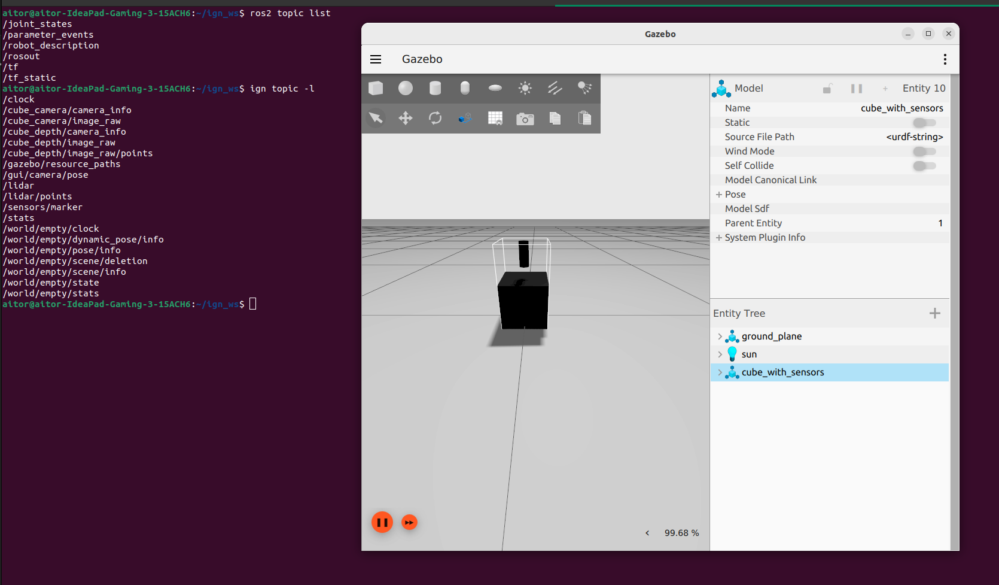
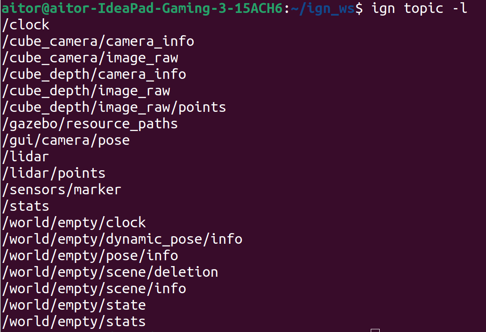
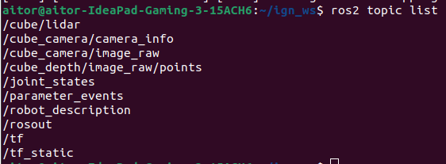
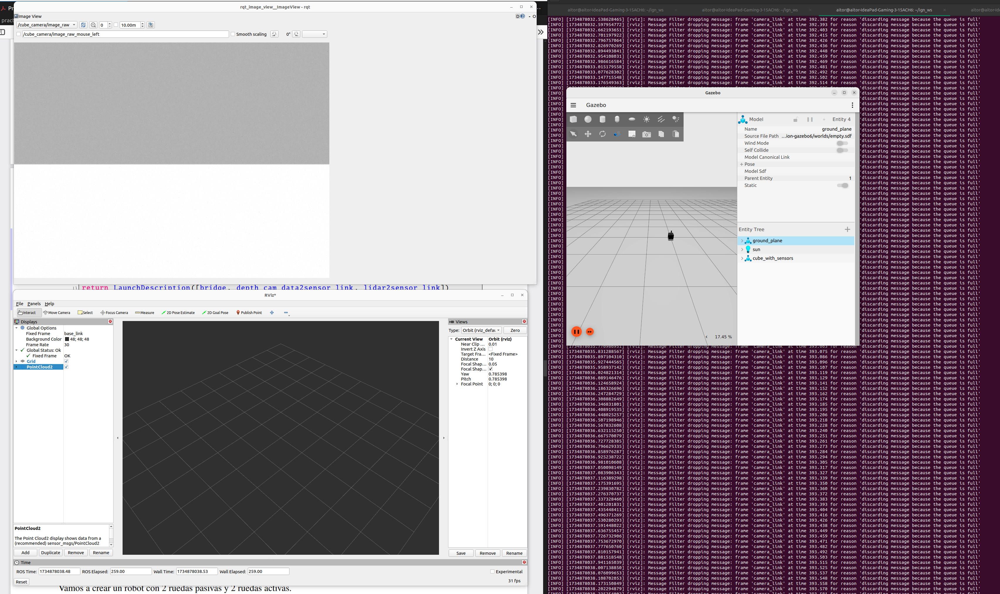
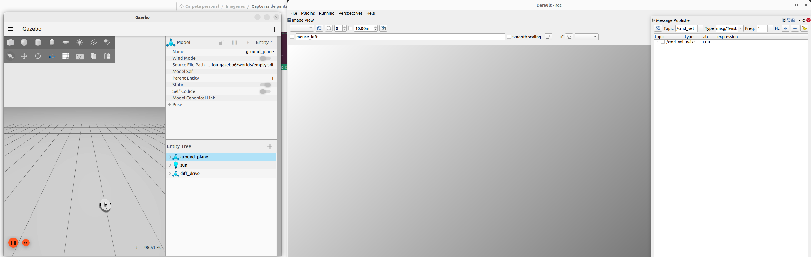
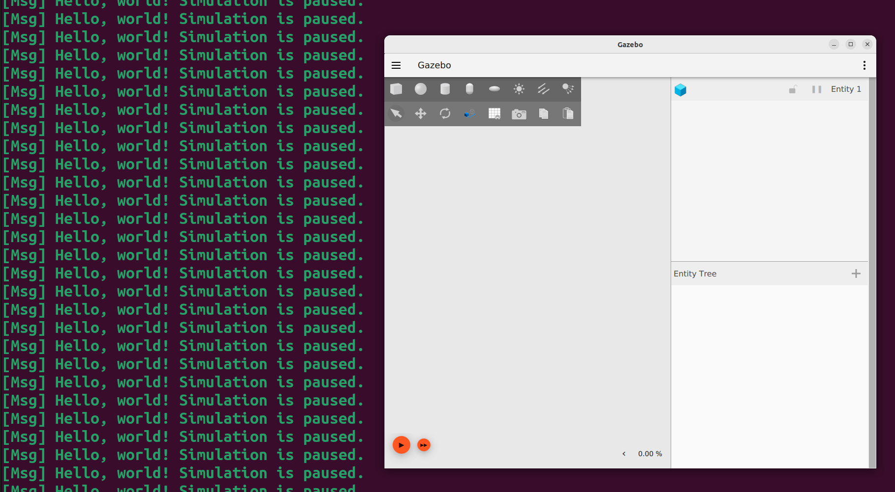

# Práctica 3: Integración de Gazebo Fortress

En esta práctica tenemos dos bloques. Por un lado, tenemos la parte relacionada con Gazebo Ignition, tal y como se recoge en el pdf. Por otro lado, tenemos la parte relacionada con los videos de las clases donde se construye un entorno con Turtlebot3.

## Turtlebot3 

En este primer punto, vamos a reflejar los pasos para instalar estas dependencias que necesitaremos para las prácticas posteriores.

```bash
mkdir -p turtlebot3_ws/src
cd turtlebot3_ws/src
git clone https://github.com/Onicc/navigation2_ignition_gazebo_turtlebot3.git
colcon build
export ROS_LOCALHOST_ONLY=1
export TURTLEBOT3_MODEL=waffle
source install/setup.bash
ROS_LOCALHOST_ONLY=1 TURTLEBOT3_MODEL=waffle ros2 launch turtlebot3 simulation.launch.py
```
Además, instalaremos algunas dependencias necesarias:
```bash
sudo apt-get install ros-humble-navigation2 ros-humble-nav2-bringup ros-humble-ros-ign-gazebo ros-humble-ros-ign-bridge
```


Info:
- https://emanual.robotis.com/docs/en/platform/turtlebot3/quick-start/
- https://github.com/Onicc/navigation2_ignition_gazebo_turtlebot3

## Integración de Gazebo Fortress

Primero creamos un nuevo espacio de traballo llamado `ign_ws` donde clonaremos el repositorio: https://github.com/fjrodl/ROS2andGazebo.git

```bash
mkdip -p ign_ws/src
git clone https://github.com/fjrodl/ROS2andGazebo.git
rosdep install --from-paths src --ignore-src -r -y
colcon build --symlink-install
source install/setup.bash
```

Tenemos en cuenta que Gazebo ignition los instalamos de paquete. Seguimos el guión de la práctica paso a paso. No comentaremos paso por paso con mucho detalle porque ya se encuentran muy bien detallados en el guión de la práctica.

### Ejemplo 1
En este ejemplo se configura un plugin de teclado dentro de Gazebo para capturar y procesar pulsaciones. La simulación comienza con una escena vacía en Gazebo, a la cual se añade el plugin llamado Key Publisher. Este plugin permite detectar las teclas presionadas en el teclado mientras se interactúa con la simulación. Los datos de estas pulsaciones se publican en un tópico llamado /keyboard/keypress. Para verificar el correcto funcionamiento del plugin, se puede escuchar el contenido de este tópico, que muestra las teclas presionadas en tiempo real. Este ejemplo establece una base para conectar eventos del usuario en la simulación.



### Ejemplo 2
En este ejemplo de define un modelo de objeto estático, un cubo, incluyendo detalles de su geometría, propiedades físicas como masa, inercia y colisiones, y su apariencia visual. Una vez que el archivo SDF está listo, se utiliza para desplegar el objeto en la simulación, lo que permite verlo interactuar con el entorno físico simulado. Para lanzarla ejecutamos el siguiente comando:

```bash
ros2 launch spawn_simple_object spawn_model.launch.py
```



### Ejemplo 3
En este ejemplo se amplia el modelo anterior añadiendo diversos sensores como son una camara, profundidad y LiDar. Cada sensor está vinculado al modelo principal a través de joints y configuraciones específicas que permiten ajustar parámetros como rango, frecuencia de actualización y tópicos de publicación. Este enfoque modular permite activar o desactivar sensores según las necesidades del experimento. Los datos generados por estos sensores se publican en tópicos específicos que pueden ser visualizados o procesados en ROS 2.

```bash
sudo apt-get install ros-humble-realsense2-camera
colcon build
ign_ws
ros2 launch gazebo_sensors cube_with_sensors.launch.py
```



### Ejemplo 4
Para transferir los datos de Gazebo a ROS 2 debemos utilizar el `ros_gz_bridge`. El *bridge* crea un puente que permite el intercambio de mensajes entre ROS y Gazebo. Los *bridge* entre ROS2 y Gazebo pueden ser bidireccionales, o unidireccionales.

```bash
cd ign_ws
colcon build --symlink-install
source install/setup.bash
ros2 launch gazebo_sensors cube_with_sensors.launch.py
```
Comprobamos los tópics de Gazebo:



En otro terminal:
```bash
cd ign_ws
colcon build --symlink-install
source install/setup.bash
ros2 launch gazebo_sensors gazebo_bridge.launch.py
```

Una vez lanzamos los puentes, comprobamos los nuevos tópicos:



En otra terminal:
```bash
sudo apt-get install ros-humble-rqt-*
ros2 run rqt_image_view rqt_image_view
```



### Ejemplo 5
Este ejemplo guía la creación de un robot móvil con dos ruedas activas y dos ruedas pasivas, usando un diseño modular en Xacro. El robot incluye un plugin de conducción diferencial que permite controlar las ruedas activas para mover el robot. El archivo Xacro describe la estructura física del robot, incluyendo enlaces, articulaciones y sensores adicionales como LIDAR. Una vez configurado el modelo, el archivo de lanzamiento inicializa el robot en Gazebo, publica su descripción en ROS 2 y utiliza el puente ros_gz_bridge para permitir el control del robot desde ROS 2. Esto incluye comandos de velocidad y recepción de odometría para monitorear su movimiento.



### Ejemplo 6 
En este ejemplo se desarrolla un plugin en C++ para personalizar funcionalidades en Gazebo. El plugin interactúa directamente con la simulación, proporcionando flexibilidad para añadir características únicas al entorno o a los robots. El ejemplo básico consiste en un plugin que imprime mensajes en la consola de Gazebo, indicando si la simulación está pausada o activa. Este plugin se puede extender para implementar lógica personalizada, como controles avanzados de robots o simulaciones físicas específicas. Este paso introduce la programación de plugins como una herramienta poderosa para expandir las capacidades estándar de Gazebo.

Como estamos usando los archivos del repo clonado, seguimos los siguientes pasos:

```bash
cd helloworld
mkdir build
cd build
cmake ..
make 
cd ..
export GZ_SIM_SYSTEM_PLUGIN_PATH=`pwd`/build
ign gazebo -v 3 hello_world_plugin.sdf
```


