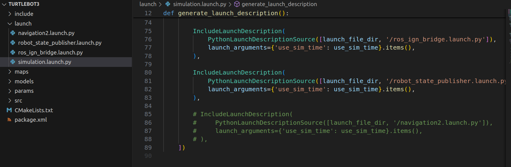
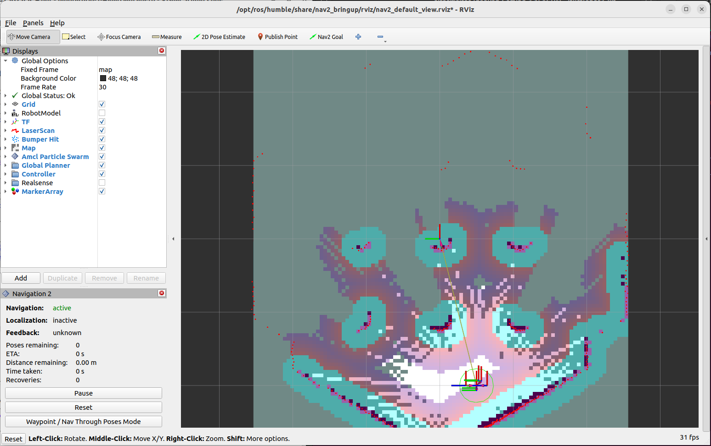
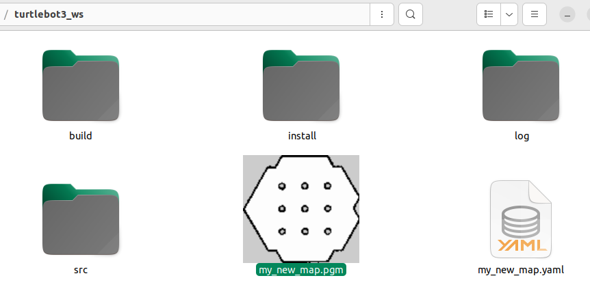

# Práctica 4: Creación de Mapas con SLAM Toolbox

## Ejercicio práctico

Recordemos que Turtlebot3 ya fue instalado en la [practica3](../practica_3/readme_3.md). Para este procedimiento hemos comentado las siguientes lineas:



```bash
# Instalamos los paquetes de Nav2 y slam_toolbox con los comandos:
sudo apt install ros-humble-navigation2 ros-humble-nav2-bringup
sudo apt install ros-humble-slam-toolbox


# Nos movemos al directorio donde tenemos Turtlebot3
cd turtlebot3_ws
colcon build
source install/setup.bash

# Verificamos el tópico /scan necesario para slam_toolbox:
ros2 topic list
ros2 topic info /scan

# Lanzamos en esta primera terminal la simulación de Gazebo:
TURTLEBOT3_MODEL=waffle ros2 launch turtlebot3 simulation.launch.py

# Terminal 2: Iniciamos el stack de Navigation 2:
ros2 launch nav2_bringup navigation_launch.py use_sim_time:=True

# Terminal 3: Iniciamos slam_toolbox
ros2 launch slam_toolbox online_async_launch.py use_sim_time:=True

# Terminal 4: Iniciamos RViz con la configuración predefinida:
ros2 run rviz2 rviz2 -d /opt/ros/humble/share/nav2_bringup/rviz/nav2_default_view.rviz

# Terminal 5: Controlamos la diámica del robot para que explore el entorno y genere el mapa en RViz.
ros2 run teleop_twist_keyboard teleop_twist_keyboard

# Guardamos el mapa ejecutado
ros2 run nav2_map_server map_saver_cli -f my_map
```

Cabe destacar que este procedimiento se podía realizar con Turtebot4 con el siguiente comando:
```bash
ros2 launch turtlebot4_ignition_bringup turtlebot4_ignition.launch.py slam:=true nav2:=true rviz:=true
```

El estado inicial del mapa sin explorar:



Una vez hemos explorado el mapa y ejecutado el comando para guardar el mismo, se nos generan dos archivos: my_new_map.yaml(metadatos) y my_new_map.pgm (imagen del mapa)



## Preguntas

**a) ¿Cuál es la función del paquete **slam_toolbox** en ROS 2 y cómo contribuye a la generación de mapas en un entorno simulado?**  

El paquete **slam_toolbox** proporciona algoritmos de localización y mapeo simultáneos (SLAM) para robots móviles en ROS 2. Permite, entre otras cosas: 
- **Crear y actualizar mapas** de manera incremental mientras el robot se desplaza, así como localizar al robot dentro del mapa que se va generando.
- **Localizar al robot** dentro del mapa que s eva generando (o en un mapa previamente existente).
- **Editar o fusionar mapas** y utilizar diversas funcionalidades avanzadas (por ejemplo, modo continuo, ajuste de bucles, etc.).

En un entorno simulado (por ejemplo, Gazebo), slam_toolbox se suscribe a los datos del sensor láser (o LIDAR) publicados en un tópico (por defecto, /scan) y utiliza dicha información para ir construyendo el mapa en tiempo real a medida que el robot explora el entorno virtual.

**b) Describe el propósito del comando `ros2 launch` y explica cómo se utiliza para iniciar la simulación de TurtleBot3 en Gazebo.**  

El comando `ros2 launch` en ROS 2 está diseñado para iniciar múltiples nodos y configuraciones de manera organizada mediante archivos de lanzamiento (launch files). Estos archivos, generalmente escritos en Python (`.launch.py`), contienen definiciones detalladas sobre qué nodos deben ejecutarse, qué parámetros deben configurarse, y cómo se deben interconectar los diferentes componentes del sistema robótico.

Para iniciar la simulación de TurtleBot3 en Gazebo, se utiliza un comando específico que configura el modelo del robot y lanza el entorno de simulación. A continuación, se detalla el comando proporcionado:

```bash
TURTLEBOT3_MODEL=waffle ros2 launch turtlebot3 simulation.launch.py
```

La variable de entorno especifica el modelo de Turtlebot3 que vamos a simular (burger, waffle, waffle_pi).

Iniciamos el lanzamiento *simulation.launch.py* en ROS2 contenido en el paquete *turtlebot3*.

**c) ¿Qué tipo de información proporciona el tópico /scan y por qué es importante para el proceso de SLAM?.**

El tópico /scan publica mensajes del tipo sensor_msgs/LaserScan, los cuales contienen:

- Distancias medidas por el láser en cada ángulo de barrido.
- Ángulo mínimo, ángulo máximo y resolución angular.
- Rango mínimo y máximo del sensor.

Esta información es esencial para SLAM porque:

- Permite detectar obstáculos y la forma del entorno.
- Facilita la generación del mapa al ubicar las lecturas del láser en un marco de referencia (generalmente, la odometría del robot o el sistema de coordenadas “map”).
- Ayuda a localizar al robot dentro del entorno, comparando las observaciones láser actuales con el mapa existente.

En definitiva, la información publicada es de suma importancia para que SLAM sea capaz de construir y actualizar el mapa en tiempo real.

**d) ¿Cómo se guardan los mapas generados en ROS 2 y qué archivos se generan en el proceso? Explica el contenido de cada archivo.**

Para guardar el mapa hemos empleado el comando:

```bash
ros2 run nav2_map_server map_saver_cli -f my_map
```

Se nos generan dos archivos: my_new_map.yaml(metadatos) y my_new_map.pgm (imagen del mapa).

Archivo de imagen (.png o .pgm):

- Zonas ocupadas (por obstáculos) normalmente se pintan en negro.
- Zonas libres en blanco.
- Zonas desconocidas en gris (dependiendo de la configuración).

Archivo de metadatos (.yaml). Describe la información necesaria para interpretar la imagen como un mapa:

- image: ruta al archivo de imagen.
- resolution: resolución del mapa (metros por pixel).
- origin: posición del “pixel” (0,0) en el marco de coordenadas del mapa.
- negate, occupied_thresh, free_thresh: parámetros para indicar cómo se deben interpretar los valores de los píxeles (umbrales).

En definitiva, estos dos archivos permiten que el robot o cualquier otro nodo de navegación (por ejemplo, Nav2) pueda cargar el mapa y localizarse dentro de él en futuros arranques.