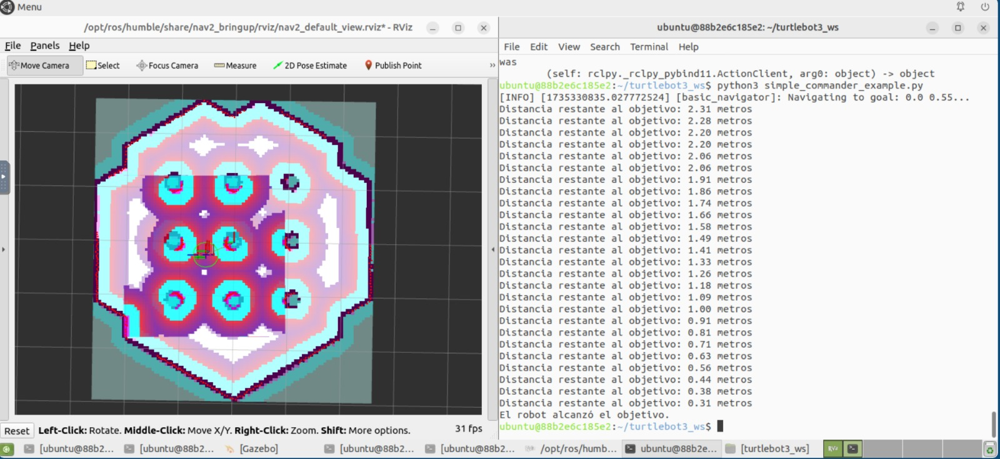

# Práctica 5: Navegación con Nav2 Simple Commander

## Ejemplo práctico

Si no están las dependencias instaladas, se ejecuta el siguiente comando:
```bash
sudo apt install ros-humble-navigation2 ros-humble-nav2-simple-commander
```

Lanzamos turtlebot3
```bash
cd turtlebot3_ws
colcon build
source /opt/ros/humble/setup.bash
source install/setup.bash
export TURTLEBOT3_MODEL=waffle
ros2 launch turtlebot3 simulation.launch.py
```

En otro terminal comprobamos los topic y lanzamos el script de navegación
```bash
ros2 topic list
python3 simple_commander_example.py
```



## Preguntas

**1. ¿Cuál es la función de Nav2 Simple Commander y cómo ayuda en la automatización de tareas de navegación?**

Nav2 Simple Commander es una interfaz de Python incluida en el stack de Navigation2 (Nav2) para ROS 2. Su objetivo principal es facilitar la interacción con los nodos de navegación de manera programática. Proporciona métodos sencillos para:

- Enviar metas de navegación (goals) al planificador.
- Monitorizar el progreso del robot hacia esas metas.
- Detener la navegación cuando sea necesario o reiniciarla.
- Encadenar acciones como parte de un flujo de trabajo, sin tener que interactuar manualmente con múltiples temas o servicios.

Gracias a esta simplificación, Nav2 Simple Commander se usa frecuentemente para automatizar secuencias de navegación, por ejemplo:

- Realizar pruebas de stress testing del planificador.
- Ejecutar recorridos de patrullaje en entornos simulados o reales.
- Configurar misiones “multi-goal” donde el robot deba visitar múltiples localizaciones en orden.

**2. ¿Qué efecto tiene el parámetro inflation radius en el archivo costmap parameters.yaml y cómo afecta la navegación del robot?**

El parámetro *inflation radius* define distancia de seguridad al rededor de los abstaculos para evitar que el robot se acerque demasiado a ellos. Puede ajustarse en función del tamaño del robot y de las limitaciones operativas. Este parámetro afecta tanto a la seguridad como a la eficiencia de la navegación.

**3. ¿Cómo podrı́as utilizar un script en Nav2 Simple Commander para automatizar una prueba de navegación en un entorno simulado?**

Para esto, se puede revisar el [script](./simple_commander_example.py). Atendiendo a esto, tenemos un bloque de inicialización de la estancia de anvegación `navigator = BasicNavigator()`. Definimos la posición de navegación objetivo a la que queremos que llegue el robot `goal_pose` con las coordenadas deseadas y la orientación en el marco de referencia `map`. Enviamos el objetivo de navegación a nuestro robot `navigator.goToPose(goal_pose)` y se monitoriza la navegación.

**4. Describe un caso en el que modificar el archivo planner server.yaml podrı́a mejorar el rendimiento de navegación.**

Modificando el planner_server.yaml, empleando una heurística más eficiente que reduzca los tiempos de cálculo como es A*. Ajustando la velocidad máxima ligeramente a 0.3 (controller_server.yaml), nos permite avanzar más rápido en zonas seguras. Aumentar ligeramente el radio de la base del robot (robot_raius) nos permite que el robot navegue de una manera más segura al tener una tolerancia de colisión extra con los objetos.