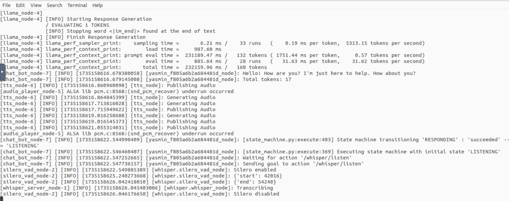

# Práctica 6: Integración de un Chatbot en ROS 2

## Descripción del proceso de instalación y configuración realizado
Para el correcto funcionamiento de la práctica hemos seguido los siguientes pasos:
```bash
mkdir -p chatbot_ws/src
cd ~/chatbot_ws/src
git clone https://github.com/mgonzs13/chatbot_ros
vcs import < chatbot_ros/dependencies.repos
cd ~/ros2_ws
rosdep install --from-paths src --ignore-src -r -y
pip3 install -r src/llama_ros/requirements.txt
pip3 install -r src/whisper_ros/requirements.txt
pip3 install -r src/tts_ros/requirements.txt --use-deprecated=legacy-resolver
pip unimstall numpy
pip install numpy==1.23.5
colcon build 
source /opt/ros/humble/setup.bash
source install/setup.bas
ros2 launch chatbot_bringup chatbot.launch.py
```

La ejecución exitosa del chatbot se puede ver en la siguiente imagen:


## Resolución de problemas encontrados

Para poder emplear el comando vcs en ROS2, tenemos que instalar la herramiento correspondiente.
```bash
sudo apt update
sudo apt install python3-vcstool
```

Ahora ya podemos ejecutar:
```bash
vcs import < chatbot_ros/dependencies.repos
```

Instalamos la dependencias de ROS2:
```bash
rosdep install --from-paths src --ignore-src -r -y
pip3 install -r src/tts_ros/requirements.txt --use-deprecated=legacy-resolver
```

Además, hemos tenido problemas con la versión de python. Estos se han solucionando como se detalla en el proceso de instalación ya visto.